<div align="center">

# 📧 Cold Mail Generator Pro

**AI-Powered Hyper-Personalized Business Outreach System**

[](https://python.org)
[](https://langchain.com)
[](https://groq.com)
[](https://streamlit.io)
[](https://www.trychroma.com/)
[](LICENSE)

---

*A production-grade RAG (Retrieval-Augmented Generation) system that transforms job postings into compelling, personalized cold emails with semantic portfolio matching.*

[Features](#-features) • [Architecture](#-architecture) • [Installation](#-installation) • [Usage](#-usage) • [Tech Stack](#-tech-stack)

---

<!-- Add your demo GIF here -->
<!--  -->

</div>

## 🎯 Overview

**Cold Mail Generator Pro** is a modular AI engineering solution designed for high-volume, personalized business development outreach. Built with enterprise-grade architecture principles, it leverages state-of-the-art LLMs through Groq Cloud's ultra-low-latency inference API.

> **💡 Mustafa's Engineering Insight:**  
> *"Traditional cold outreach suffers from a ~2% response rate. By implementing semantic portfolio matching and context-aware generation, we've engineered a system that crafts emails as if a senior BDE spent 15 minutes researching each prospect—but in under 3 seconds."*

---

## ✨ Features

| Feature | Description |
|---------|-------------|
| 🎯 **Hyper-Personalization** | Dynamically adapts email content based on extracted job requirements and matched portfolio projects |
| ⚡ **Token Efficiency** | Model tiering strategy—lightweight models for extraction, powerful models for creative writing |
| 🔍 **Semantic Portfolio Matching** | ChromaDB-powered vector search finds the most relevant case studies for each opportunity |
| 🏗️ **Modular Architecture** | Clean separation of concerns with dedicated modules for UI, LLM chains, and data management |
| 📊 **Real-Time Processing Feedback** | Streamlit's `st.status` provides live progress tracking during generation |
| 🚀 **Production-Ready Caching** | `st.cache_resource` ensures optimal performance for repeated operations |

---

## 🏗️ Architecture

### System Workflow

```mermaid
sequenceDiagram
    autonumber
    participant U as 👤 User
    participant UI as 🖥️ Streamlit UI
    participant WL as 🌐 WebBaseLoader
    participant UT as 🔧 Utils
    participant LLM1 as 🧠 Llama 3.1 8B<br/>(Extraction)
    participant VDB as 📦 ChromaDB
    participant LLM2 as 🧠 Llama 3.3 70B<br/>(Generation)

    U->>UI: Submit Job URL
    UI->>WL: Fetch Page Content
    WL-->>UI: Raw HTML/Text
    UI->>UT: clean_text(raw_content)
    UT-->>UI: Cleaned Content
    UI->>LLM1: Extract Job Details
    LLM1-->>UI: Structured JSON<br/>{role, skills, experience}
    UI->>VDB: query_links(skills)
    VDB-->>UI: Matched Portfolio Links
    UI->>LLM2: Generate Personalized Email
    LLM2-->>UI: Cold Email Content
    UI->>U: Display Generated Email
```



### Module Responsibilities

```
cold-mail-generator/
├── app/
│   ├── main.py          # Streamlit UI orchestration
│   ├── chains.py        # LLM chain definitions & prompt engineering
│   ├── portfolio.py     # ChromaDB vector store management
│   ├── utils.py         # Text preprocessing utilities
│   └── resource/
│       └── my_portfolio.csv  # Portfolio data source
├── .env                 # Environment configuration
├── requirements.txt     # Python dependencies
└── README.md
```

---

## 🔬 Technical Deep Dive

### Model Tiering Strategy

> **💡 Mustafa's Engineering Insight:**  
> *"Not all tasks require the same cognitive load. Extraction is a pattern-matching problem; creative writing demands nuanced reasoning. By tiering our models, we achieve 3x cost efficiency without sacrificing output quality."*

| Task | Model | Rationale |
|------|-------|-----------|
| Job Data Extraction | Llama 3.1 8B | Structured output, lower latency, cost-effective |
| Email Generation | Llama 3.3 70B | Superior creative writing, nuanced tone matching |

### Semantic Similarity Engine

The portfolio matching system uses **cosine similarity** to find the most relevant projects for each job posting:

$$
\text{similarity} = \cos(\theta) = \frac{\mathbf{A} \cdot \mathbf{B}}{\|\mathbf{A}\| \|\mathbf{B}\|}
$$

Where:
- $\mathbf{A}$ = Embedding vector of job skills
- $\mathbf{B}$ = Embedding vector of portfolio tech stack
- $\theta$ = Angle between vectors in high-dimensional space

ChromaDB handles the embedding generation and similarity search, returning the top-k most relevant portfolio entries.

### Text Preprocessing Pipeline

The `utils.py` module implements context-aware text cleaning:

```python
# Preserves technical terms like C++, .NET, Node.js
# Removes HTML artifacts, URLs, and excessive whitespace
# Maintains semantic integrity for downstream LLM processing
```

---

## 📦 Installation

### Prerequisites

- Python 3.10+
- Groq Cloud API Key ([Get one here](https://console.groq.com))

### Step-by-Step Setup

```bash
# 1. Clone the repository
git clone https://github.com/yourusername/cold-mail-generator.git
cd cold-mail-generator

# 2. Create and activate virtual environment
python -m venv venv

# Windows
venv\Scripts\activate

# macOS/Linux
source venv/bin/activate

# 3. Install dependencies
pip install -r requirements.txt

# 4. Configure environment variables
echo "GROQ_API_KEY=your_api_key_here" > .env

# 5. Launch the application
cd app
streamlit run main.py
```

### Dependencies

Create a `requirements.txt` with:

```txt
streamlit>=1.40.0
langchain>=0.3.0
langchain-groq>=0.2.0
langchain-community>=0.3.0
chromadb>=0.5.0
python-dotenv>=1.0.0
pandas>=2.0.0
beautifulsoup4>=4.12.0
```

---

## 🚀 Usage

1. **Launch the Application**
   ```bash
   streamlit run app/main.py
   ```

2. **Enter a Job Posting URL**
   - Paste any careers page URL (e.g., LinkedIn, company career sites)

3. **Click Submit**
   - Watch real-time progress as the system:
     - Scrapes and cleans the page
     - Extracts job requirements
     - Matches relevant portfolio items
     - Generates personalized email

4. **Copy & Send**
   - Review the generated email
   - Make any final adjustments
   - Send to your prospect

---

## 🛠️ Tech Stack

| Technology | Purpose | Version |
|------------|---------|---------|
|  | Core Runtime | 3.10+ |
|  | LLM Orchestration | 0.3+ |
|  | LLM Inference API | Cloud |
|  | Web UI Framework | 1.40+ |
|  | Vector Database | 0.5+ |
|  | Data Processing | 2.0+ |

---

## 📁 Module Documentation

### `main.py` - UI Orchestration

```python
# Key Features:
# - st.cache_resource: Singleton pattern for LLM and Portfolio instances
# - st.status: Real-time progress tracking during generation
# - Error boundary with user-friendly feedback
```

### `chains.py` - LLM Chain Definitions

```python
# Components:
# - extract_jobs(): Structured JSON extraction from raw text
# - write_mail(): Prompt-engineered email generation
# - JsonOutputParser: Type-safe LLM output handling
```

### `portfolio.py` - Vector Store Management

```python
# Features:
# - Lazy loading with collection count check
# - Persistent ChromaDB storage
# - Semantic query interface for skill matching
```

### `utils.py` - Text Preprocessing

```python
# Capabilities:
# - HTML tag removal
# - URL stripping
# - Whitespace normalization
# - Technical term preservation
```

---

## 🔮 Roadmap

- [ ] Multi-language email generation
- [ ] A/B testing framework for email variants
- [ ] CRM integration (HubSpot, Salesforce)
- [ ] Browser extension for one-click generation
- [ ] Analytics dashboard for response tracking

---

## 🤝 Contributing

Contributions are welcome! Please read our [Contributing Guidelines](CONTRIBUTING.md) before submitting a PR.

```bash
# Fork the repository
# Create your feature branch
git checkout -b feature/amazing-feature

# Commit your changes
git commit -m 'feat: add amazing feature'

# Push to the branch
git push origin feature/amazing-feature

# Open a Pull Request
```

---

## 📄 License

This project is licensed under the MIT License - see the [LICENSE](LICENSE) file for details.

---

## 👨‍💻 Author

<div align="center">

**Mustafa**  
*Senior Business Development Executive*  
**Synthetix AI**

[](https://linkedin.com)
[](mailto:mustafa@synthetixai.com)

---

*Built with ❤️ and ☕ by the Synthetix AI Engineering Team*

</div>
